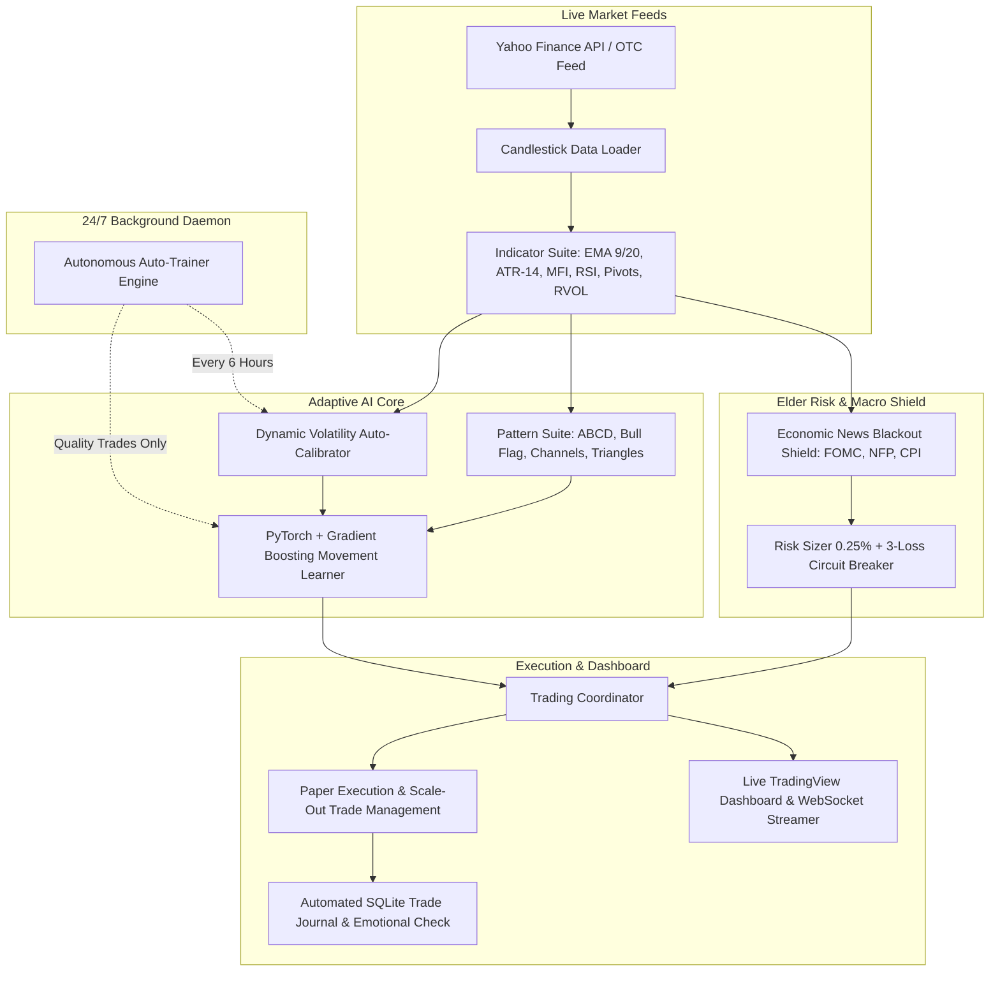

<div align="center">

# ⚡ ElderAlpha AI: Autonomous Day Trading Assistant

### Self-Calibrating Market Copilot & Machine Learning Engine for Forex & Crypto
**Codifying Andrew Elder's *Day Trading Strategies (Book 2)***

[](https://github.com/sangeethhk/trade_helper/actions)
[](https://www.python.org/)
[](https://fastapi.tiangolo.com)
[](https://pytorch.org/)
[](https://www.docker.com/)
[](https://huggingface.co/spaces/sangeethhk/trade-helper)
[](CONTRIBUTING.md)

[**🌐 Live Hugging Face Demo**](https://huggingface.co/spaces/sangeethhk/trade-helper) • [**Key Features**](#-key-features) • [**Quickstart**](#-quick-start) • [**Codified Elder Rules**](#-andrew-elder-book-2-codification) • [**Cloud 24/7**](#-247-cloud-deployment) • [**Contributing**](#-contributing)

</div>

---

## 📖 Overview

**ElderAlpha** is an institutional-grade, open-source algorithmic trading copilot designed to eliminate emotional decision-making, enforce disciplined risk rules, and detect high-probability price action patterns.

Engineered directly from the core strategies and psychological disciplines of **Andrew Elder's *Day Trading Strategies (Book 2)***, ElderAlpha pairs **PyTorch microstructural movement learning** with **dynamic volatility auto-calibration**, a **high-impact economic news blackout shield**, and a **real-time TradingView-style web dashboard**.

---

## 🌟 Key Features

### 🧠 1. Movement Learner & Autonomous Continuous Training
- **Dual-Engine ML Architecture:** Combines deep Multi-Layer Perceptrons (MLP) with Gradient Boosting to predict whether price action will achieve a $\ge 2.0R$ target before stopping out.
- **Trained on Elder Quality Trades Only:** Rejects noisy, low-volume chop ($RVOL \ge 1.15$, $ATR \ge 0.5 \times ATR_{14}$, trend alignment, and decisive rejection wicks).
- **Benchmark Performance:**
  - **BTC/USD:** 1,086 Quality Trades $\rightarrow$ **78.3% High-Confidence Win Rate**
  - **ETH/USD:** 1,275 Quality Trades $\rightarrow$ **75.5% High-Confidence Win Rate**
  - **SOL/USD:** 1,149 Quality Trades $\rightarrow$ **74.0% High-Confidence Win Rate**
- **24/7 Autonomous Background Auto-Trainer:** Runs in a non-blocking daemon thread. Checks asset staleness every 60 seconds and automatically retrains stale models on fresh 30–60 day history every 6 hours with zero UI lag.

### 🛡️ 2. High-Impact Economic News Shield
- **Andrew Elder Rule (Ch 4 & 11):** *"Never trade into major high-impact announcements. Spreads widen violently, liquidity vanishes, and slippage blows through stops."*
- **Macro & Crypto Event Tracking:** Automatically monitors FOMC Rate Decisions, Fed Press Conferences, Non-Farm Payrolls (NFP), Core CPI Inflation, ECB/BoE/BoJ announcements, and Deribit Crypto Options Expiry.
- **Automated Trade Skipping:** Trade execution is automatically **blocked and skipped** 30 minutes before to 30 minutes after high-impact events.
- **Live Alert Banner & Drawer:** Shows active blackout countdowns and upcoming macro calendar events with impact tags (`HIGH` / `MED`).

### 🎯 3. Andrew Elder Pattern Recognition Engine
- **ABCD Pattern (Chapter 11):** Pinpoints harmonic impulses ($A \rightarrow B$), Fibonacci pullbacks ($0.382 - 0.618$), and targets extension Point $D$.
- **Bull Flag Momentum (Chapters 14 & 24):** Detects strong poles, low-volume consolidation flags, and breakout triggers on high Relative Volume ($\text{RVOL} \ge 1.8\text{x}$).
- **Range & Channel Trading with ATR (Chapter 8):** Maps boundaries and sets dynamic ATR trailing stops to prevent premature shakeouts.
- **Consolidation Chart Patterns (Chapter 6):** Detects Triangles, Double/Triple Bottoms, and Head & Shoulders reversals.
- **Floor Pivot Points (Chapters 9 & 12):** Standard Daily Floor Pivots ($P, R_1-R_3, S_1-S_3$) for turning point support and resistance.
- **Derivatives & Hedging Advisory (Chapters 13, 15, 27, 28):** Options Strangles, Straddles, and protective hedging structures.

### ⚖️ 4. Institutional Quantitative Risk Engine
- **0.25% - 1.0% Beginner Capital Rule (Chapters 2 & 3):** Automatically calculates exact position sizes (lots or coin units) based on stop-loss distance.
- **2:1 Minimum Payout Ratio (Chapter 4):** Requires potential reward to be at least double the risk before triggering a signal.
- **Scale-Out Execution:** Sells 50% at Target 1 and automatically moves the Stop Loss to Breakeven.
- **Circuit Breakers & Session Gain Lock:** Automatically halts after 3 consecutive losses, limits weekly drawdown to 1%, and locks in profits when session gains exceed $+0.5\%$.

---

## 🏗️ Architecture



---

## 📚 Andrew Elder Book 2 Codification

| Chapter in Book | Andrew Elder Principle | How ElderAlpha Codifies It |
| :--- | :--- | :--- |
| **Ch. 2 & 3** | **0.25% - 1.0% Risk Rule** | Auto-sizes every position so loss never exceeds 0.25% of account equity. |
| **Ch. 4 (p. 33)** | **2:1 Payout Ratio Target** | Signals are rejected if Reward-to-Risk ratio is under 2.0R. |
| **Ch. 4 (p. 40)** | **Session Gain Protection** | Activates lock at $+0.5\%$; halts if profits retrace to $+0.25\%$ to finish green. |
| **Ch. 4 (p. 41)** | **Economic News Blackout** | Auto-skips trades 30m before and after FOMC, NFP, CPI, and central bank decisions. |
| **Ch. 8** | **ATR Volatility Bands** | Dynamic trailing stops calibrated to asset noise (1.37x Forex, 2.11x Crypto). |
| **Ch. 11 (p. 13)** | **Partial Scale-Outs** | Sells 50% at Target 1 and immediately moves Stop Loss to Breakeven. |
| **Ch. 14 & 24** | **Relative Volume (RVOL)** | Enforces $RVOL \ge 1.8x$ to confirm genuine institutional breakout momentum. |
| **Ch. 30** | **Discipline & Journaling** | Auto-logs entry mental state, exit reasons, and flags emotional rule breaches. |

---

## 🚀 Quick Start

### 1. Clone & Install
```bash
git clone https://github.com/sangeethhk/trade_helper.git
cd trade_helper

python -m venv venv
# On Windows:
.\venv\Scripts\activate
# On Linux/macOS:
source venv/bin/activate

pip install --upgrade pip
pip install -r requirements.txt
```

### 2. Launch the Web Dashboard
```bash
python run_dashboard.py
```
Open **[http://127.0.0.1:8000](http://127.0.0.1:8000)** in your browser.

### 3. Run Automated Tests
```bash
python -m unittest discover tests
```

---

## 🐳 24/7 Cloud Deployment (Docker)

Deploy on any Cloud VPS (Hetzner, DigitalOcean, AWS, or Render) with a single command:

```bash
docker compose up -d
```
All neural network weights (`models/`), calibrations (`calibrations.json`), and trading history (`trading_journal.db`) are preserved in persistent volume mounts across restarts and rebuilds.

*See the full [**24/7 Cloud Deployment Guide**](DEPLOYMENT_GUIDE.md) for free hosting options (Render, Oracle Cloud, Cloudflare).*

---

## 🤝 Contributing

Contributions are welcome! Please read [CONTRIBUTING.md](CONTRIBUTING.md) for details on code style, testing, and submitting pull requests.

1. Fork the Project
2. Create your Feature Branch (`git checkout -b feature/NewStrategy`)
3. Commit your Changes (`git commit -m 'Add NewStrategy'`)
4. Push to the Branch (`git push origin feature/NewStrategy`)
5. Open a Pull Request

---

## ⚖️ Disclaimer

*ElderAlpha AI is an open-source educational software framework designed to codify technical trading principles and risk management rules from Andrew Elder's literature. It does not provide financial or investment advice. Trading Forex, Cryptocurrencies, and Equities carries substantial risk of loss. Always paper-trade and thoroughly backtest strategies before risking live capital.*

---

<div align="center">
  <sub>Built with ❤️ for disciplined traders. If you found this project helpful, please consider giving it a ⭐ on GitHub!</sub>
</div>
